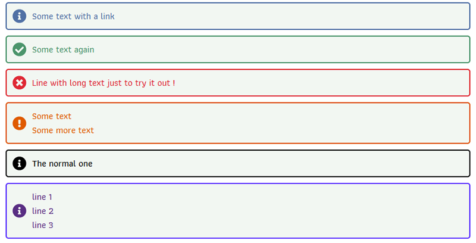

# flash
Display flash messages 

## Requirements
You need PHP8 to run this code

## Use
**Create instance with one parameter; if set to TRUE, the script will show a nice icon**

$flash = new Flash(TRUE/FALSE);


**Examples :**

```php
$flash = new Flash();
$flash->info('Some text with a <a href="#">link</a>');
$flash->success('Some text again');
$flash->error('Line with long text just to try it out !');
$flash->warn(['Some text', 'Some more text']);
$flash->normal(['The normal one']);
$flash->custom(['line 1', 'line 2', 'line 3']);
```


**Result :**


